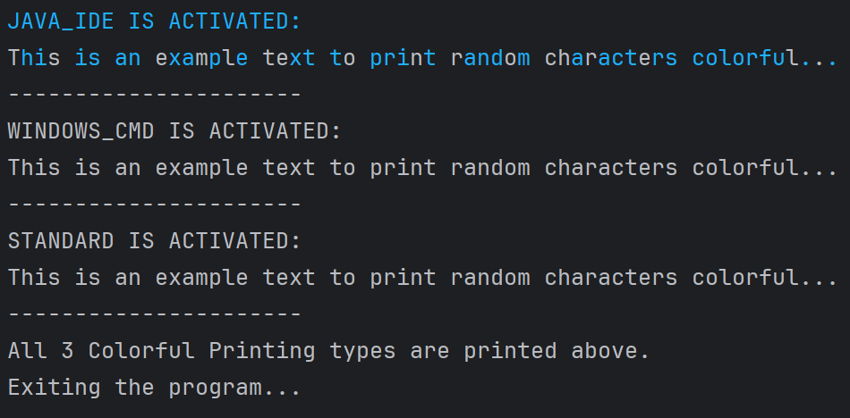
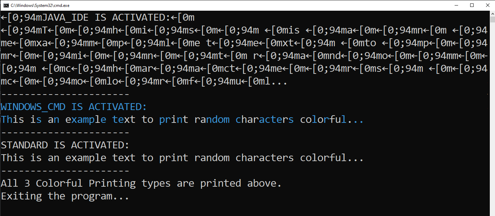

<h1><i>Colorful-Text-Console </i> </h1>

<h2>Content</h2>
<ul>
        <li><a href="#about-project">1-) About The Project</a></li>
        <li><a href="#why-project-created">2-) Why The Project Is Created?</a></li>
        <li><a href="#used-technologies">3-) Used Technologies </a></li>
        <!-- <li><a href="#images">4-) Images </a></li> -->
        <li><a href="#images">4-) Images </a>
                <ol> 
                        <li><a href="#intelij-idea-output"> Intelij IDEA Output</a></li>
                        <li><a href="#windows-cmd-output">Windows CMD Output</a></li>
                </ol>
        </li>
        <li><a href="#requirement">5-) Requirements</a></li>
         <li><a href="#quick-start">6-) Quick Start</a>
         <ol>
         <li><a href="#run-in-cmd">Run in CMD</a></li>
         <li><a href="#run-in-docker">Run in Docker</a></li>
         </ol>
         </li>
        <li><a href="#installation">7-) Installation</a></li>
        
        
</ul>

<h2 id="about-project">1-) About The Project</h2>
<b> <i>Colorful Text Console</i> </b> is a modular library that allows users to easily add colorful text output to their console applications. This library provides a simple and flexible way to customize the colors and formatting of console text, making it more visually appealing and easier to read.
<br>

<h2 id="why-project-created">2-) Why The Project Is Created?</h2>
Displaying text in color on the console can greatly improve the readability and visual impact of console-based applications. Colorful text can help users quickly identify important information, highlight key details, and create a more engaging user experience.
<br><br>
However, implementing colorful console output can be a tedious and time-consuming task for developers. <b> <i>Colorful Text Console</i> </b> library was created to address this need by providing a straightforward and customizable solution. With this library, developers can easily add colorful text to their console applications without having to write complex color formatting code.
<br><br>
The main goal of this project is to empower developers to create more visually appealing and user-friendly console applications, ultimately enhancing the overall user experience and making important information more accessible.

<h2 id="used-technologies">3-) Used Technologies</h2>

* Core Technologies:
    * JAVA SE
* Dependencies:
    * org.fusesource.jansi:jansi:2.4.0
  
  

<h2 id="images">4-) Images </h2>

<h3 id="intelij-idea-output"><li> Intelij IDEA Output </li> </h3> 
<br>

</li> <br> <br>

<h3 id="windows-cmd-output"><li> Windows CMD Output </li> </h3> 
<br>

</li> <br> <br>

<h2 id="requirement">5-) Requirements</h2>

* <a href="https://www.oracle.com/tr/java/technologies/javase/jdk11-archive-downloads.html">JDK 11</a>
* <a href="https://www.jetbrains.com/idea/download/?section=windows"> Intelij IDEA (Community Edition) </a></li> 

<h2 id="quick-start">6-) Quick Start (To see Colorful output)</h2>

* <h4 class="run-in-cmd"> Run In Windows CMD</h4>

1-) Copy and paste the following command in your cmd.
<br>

```
git clone https://github.com/AhmetEminSaglik/Console-Colorful-text.git
```
2-) Then copy and paste the following command in your cmd.
```
java -jar  Console-Colorful-text/ColorfurTextConsole.jar
```
* <h4 class="run-in-docker"> Run In Docker </h4>

1-) Copy and paste the following command in your cmd.
```
docker run --name color-console -it ahmeteminsaglik/colorful-text-console:1.0
```


<h2 id="installation">7-) Installation </h2>
1-) Copy and paste the following command in your cmd.
<br><br>

```
git clone https://github.com/AhmetEminSaglik/Console-Colorful-text.git
```

2-) You can select how to import following one of the instructors given bellow.


* <b>  Add Jar file as library: </b>


 Add `ColorfurTextConsole.jar`  to your project as Jar file in `Console-Colorful-text` folder.


* <b>   Add Jar file as Maven dependency:  </b>

<ol>
<li>

copy `org` folder in `Console-Colorful-text\maven-setup` folder to your `.m2\repository`
</li>

<li>    
Add following dependency to your project's pom.xml

```
<groupId>org.ahmeteminsaglik</groupId>
<artifactId>console-colorful-text</artifactId>
<version>1.0</version>
```

</li>
  </ol>  
<br><br>
