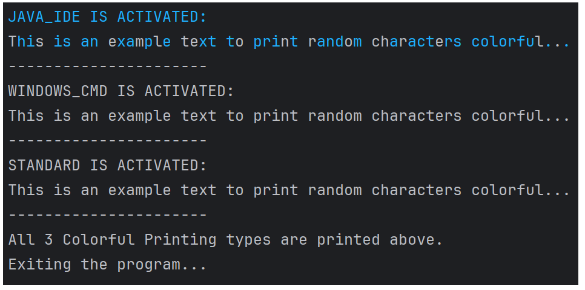
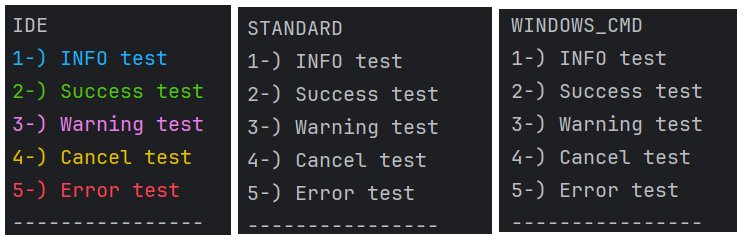
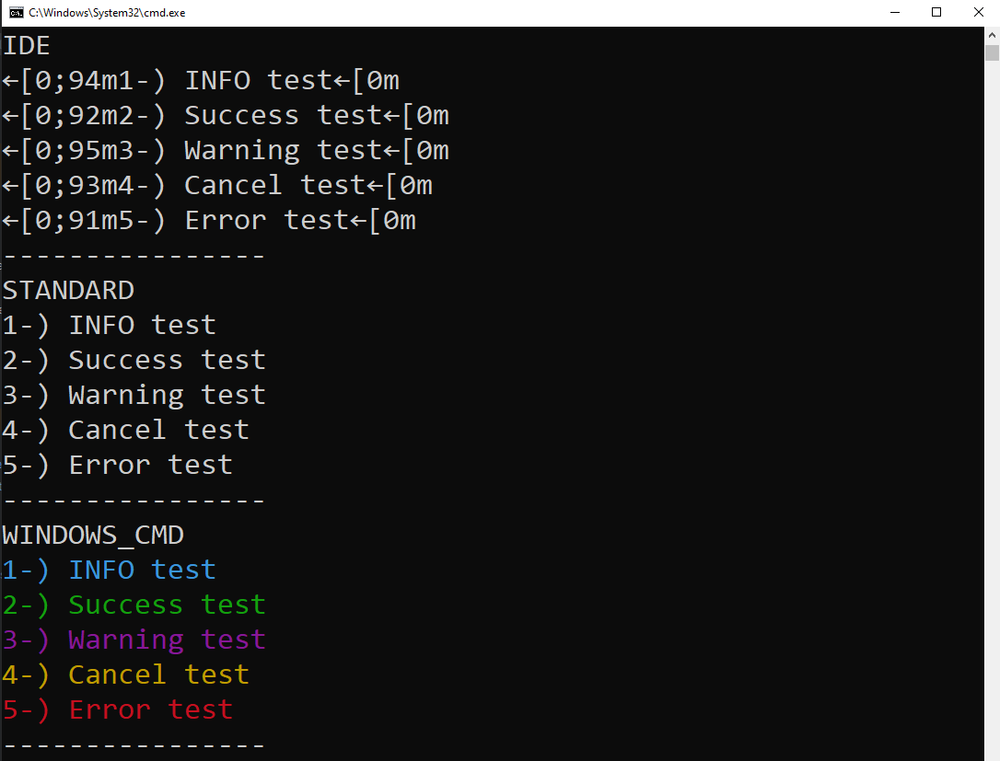
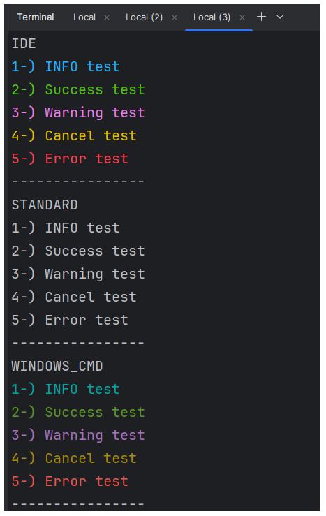

# <i>Colorful-Text-Console </i> 

## Content
<ol>
        <a href="#about-project"><li>About The Project</li></a>
        <a href="#why-project-created"><li>Why The Project Is Created?</li></a>
        <a href="#used-technologies"><li>Used Technologies</li></a>
        <a href="#image"><li>Images </li></a>
                <ol> 
                        <a href="#intelij-idea-output"><li> Intellij IDEA Output</li></a>
                        <a href="#windows-cmd-output"><li>Windows CMD Output</li></a>
                        <a href="#intelij-idea-terminal-output"> <li>Intelij IDEA - Terminal Output</li>
                </ol>
        </li>
        <a href="#requirements"><li>Requirements</li></a>
         <a href="#quick-start"><li>Quick Start</li></a>
         <ol>
	<a href="#run-in-cmd"><li>Run in CMD</li></a>
        <a href="#run-in-docker"><li>Run in Docker</li></a>
         </ol>
         </li>
        <a href="#installation"><li>Installation</li></a>
        <a href="#usage"><li>Usage</li></a>
        <a href="#version-difference"><li>Version Difference</li></a>
        
</ol>

## <span id="about-project">1-) About The Project</span>

***Colorful Text Console*** is a modular library that allows users to add colorful text output to their console applications easily. This library provides a simple and flexible way to customize the colors and formatting of console text, making it more visually appealing and easier to read.
<br>

## <span id="why-project-created">2-) Why The Project Is Created?</span >
Displaying text in color on the console can greatly improve the readability and visual impact of console-based applications. Colorful text can help users quickly identify important information, highlight key details, and create a more engaging user experience.
<br><br>
However, implementing colorful console output can be a tedious and time-consuming task for developers. ***Colorful Text Console*** library was created to address this need by providing a straightforward, customizable solution. With this library, developers can easily add colorful text to their console applications without writing complex color formatting code.
<br><br>
The main goal of this project is to empower developers to create more visually appealing and user-friendly console applications, ultimately enhancing the overall user experience and making important information more accessible.

## <span id="used-technologies">3-) Used Technologies</span>

* Core Technologies:
    * JAVA SE
* Dependencies:
    * org.fusesource.jansi:jansi:2.4.0
  
  

## <span id="image">4-) Images </span>


### <span id="intelij-idea-output"><li> Intelij IDEA Output </li> </span> 
<br>

 <br>

 <br>


### <span id="windows-cmd-output"><li> Windows CMD Output </li> </span> 
<br>


<br> 



### <span id="intelij-idea-terminal-output"><li> Intelij IDEA - Terminal Output </li> </span> 
<br>




## <span id="requirements">5-) Requirements</span>

* <a href="https://www.oracle.com/tr/java/technologies/javase/jdk11-archive-downloads.html">JDK 11</a>
* <a href="https://www.jetbrains.com/idea/download/?section=windows"> Intelij IDEA (Community Edition) </a>


## <span id="quick-start">6-) Quick Start (To see Colorful output)</span>


### <span id="run-in-cmd"> Run In Windows CMD </span>

**1.** Copy and paste the following command in your cmd.
<br>

```
git clone https://github.com/AhmetEminSaglik/Console-Colorful-text.git
```
**2.** Then copy and paste the following command in your cmd.
```
java -jar  Console-Colorful-text/ColorfulTextConsole-ExampleMain.jar
```
<br>

### <span id="run-in-docker"> Run In Docker </span>

**1.** Copy and paste the following command in your cmd.

To run `v1.0`
```
docker run -it ahmeteminsaglik/colorful-text-console:1.0
```

To run `v1.1`
```
docker run -it ahmeteminsaglik/colorful-text-console:1.1
```

<br>

## <span id="installation">7-) Installation </span>
**1.** Copy and paste the following command in your cmd.

```
git clone https://github.com/AhmetEminSaglik/Console-Colorful-text.git
```

**2.** You can select how to import following one of the instructors bellowed.


* **Add Jar file as library:**

    1.  Add `ConsoleColorfulTextModule.jar`  to your project as Jar file in `Console-Colorful-text` folder.

* **Add Jar file as Maven dependency:**

    1. Copy `com` folder in `Console-Colorful-text\maven-setup` folder to your `.m2\repository`
 
    2. Add following dependency to your project's pom.xml

```
<groupId>org.ahmeteminsaglik</groupId>
<artifactId>console-colorful-text</artifactId>
<version>1.0</version>
```
<br>

## <span id="usage">8-) Usage</span>


 **1.** Update printing color for IntelliJ Idea or for other IDEs. (ConsoleColors Class is defined in the library)
```java
   PrintConsoleServiceConfig.setIdeColor(ConsoleColors.BLUE_BRIGHT);
```
Or update the printing color for CMD. (ConsoleColors Class is defined in the library)
```java
 PrintConsoleServiceConfig.setCmdColor(Ansi.Color.CYAN);
 ```
**2.**  Update printing console area. 
```java
// colorful output for Intellij Idea
PrintConsoleServiceConfig.updatePrintableService(EnumPrintOption.JAVA_IDE); 

//  colorful output for CMD
PrintConsoleServiceConfig.updatePrintableService(EnumPrintOption.WINDOWS_CMD);    

// standard output for anything.
PrintConsoleServiceConfig.updatePrintableService(EnumPrintOption.STANDARD);
```
**3.** Initialize library.
```java
PrintableConsoleService ps = new PrintableConsoleServiceManager();
```
**4.**  Print text in the requested color.
```java
System.out.println(ps.getColorfulText("colorful text"));
```
  
## <a id="version-difference">9-) Version Differences</a>

* `1.0` : User should update color to use colorful prints.

```java
// First update Color
PrintConsoleServiceConfig.setCmdColor(Ansi.Color.CYAN);
PrintConsoleServiceConfig.setIdeColor(ConsoleColors.BLUE_BRIGHT);
// Then use it like this.
ps.getColorfulText("text"); // return this string in Cyan or BlueBright color. Depends on selected color.
```
<br>

* `1.1` : New functions are added to use other colors without update always

```java
// First update Color
// return text in Info(Cyan) color.
getInfoColor("text"); 
// return text in Success(Green) color.
getSuccessColor("text");
// return text in Cancel(Yellow) color.
getCancelColor("text");
// return text in Warning(Magenta) color.
getWarningColor("text");
// return text in Error(Red) color.
getErrorColor("text");
PrintConsoleServiceConfig.setIdeColor(ConsoleColors.BLUE_BRIGHT);
// Then use it like this.
System.out.println(ps.getSuccessColor("Green colorful text will be printed."));
```